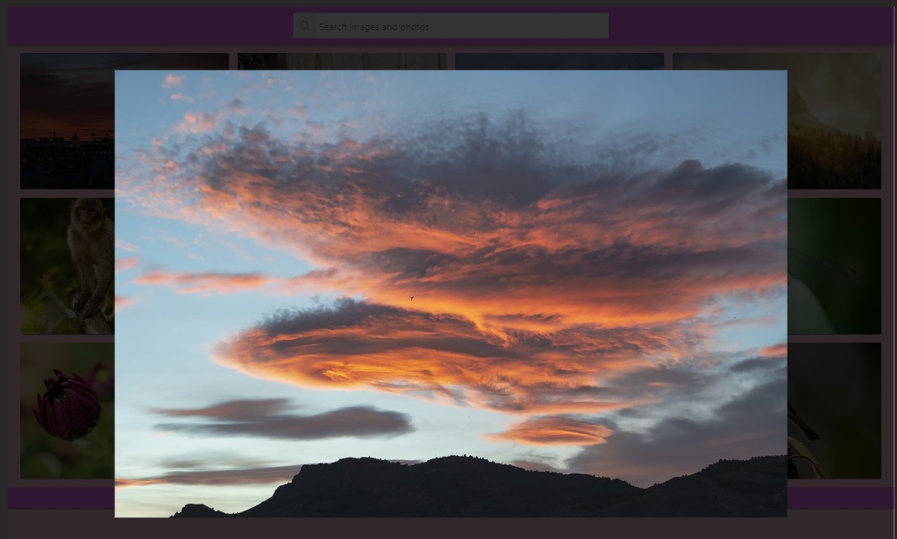

# Photo search engine app

---

A simple application for searching images by keyword using the Pixabay API

## Introduction

---

The search engine allows you to search for photos from the Pixabay API database
using a keyword. I used react-loader-spinner in the shape of three hearts. It
appears when you search for more images. After pressing the selected image, a
large modal window with the selected photo appears. You can close it by pressing
the esc key on your keyboard or using your mouse outside the image.

 
 

## Technologies

---

- HTML
- CSS
- Java Script
- React.js

## Starting up

---

### First install all required dependencies:

- npm install

- npm install react-loader-spinner

### To run the application, use the following command:

- npm start

### The application will run on localhost:3000.

## Project Structure

---

## Author

---

- Karolina Kaczorowska
- e-mail: kaczorowska.karolina@gmail.com
- GitHub: https://github.com/KaczorowskaKarolina
- LinkedIn: https://www.linkedin.com/in/karolina-kaczorowska-33b337220/
